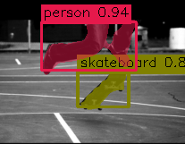

# EoMT COCO Instance Trainer

This repository is now focused on one supported workflow: pure PyTorch training for COCO instance segmentation with EoMT, producing masks and bounding boxes from the same network.

The old Lightning CLI, multi-task config tree, and dataset/task branches were removed from the maintained surface. The supported entrypoint is:

```bash
python3 -m scripts.train_coco_instance --help
```

## Scope

Supported:

- COCO instance segmentation
- EoMT with DINOv3 backbone
- Pure PyTorch training loop
- CSV metrics logging
- Checkpoint save/resume
- Zip-backed dataset loading with persistent manifest cache

Not maintained in this repo anymore:

- Lightning-based `main.py` training
- Panoptic and semantic training paths
- YAML config-driven entrypoints
- W&B-specific logging setup

## Installation

Python `3.10` to `3.13` is supported.

Using `uv`:

```bash
uv sync
```

Using `pip`:

```bash
python3 -m pip install -r requirements.txt
```

## Required Inputs

You need:

1. COCO zip files in one directory:
   - `train2017.zip`
   - `val2017.zip`
   - `annotations_trainval2017.zip`
2. A local DINOv3 repo checkout for `torch.hub.load`
3. DINOv3 pretrained weights

By default the trainer looks for:

- encoder repo: `../dinov3`
- encoder weights: `../BitNetCNN/data/dinov3_vits16_pretrain_lvd1689m-08c60483.pth`

Override them with `--encoder-repo` and `--encoder-weights` if your layout is different.

## Training

Example:

```bash
uv run python3 -m scripts.train_coco_instance \
  --data-path /path/to/coco \
  --encoder-repo /path/to/dinov3 \
  --encoder-weights /path/to/dinov3_vits16_pretrain_lvd1689m-08c60483.pth \
  --batch-size 1 \
  --num-workers 4 \
  --accelerator cuda \
  --devices 1
```

Resume training:

```bash
uv run python3 -m scripts.train_coco_instance \
  --data-path /path/to/coco \
  --resume-from-checkpoint logs/coco_instance_eomt_large_640_dinov3/checkpoints/last.pt
```

Useful flags:

- `--compile` enables `torch.compile` on the network.
- `--force-rebuild-cache` refreshes dataset manifest cache files.
- `--ckpt-path` loads model weights before training.
- `--delta-weights/--no-delta-weights` controls delta checkpoint loading.

## Outputs

Each run writes to `logs/<experiment-name>/`:

- `metrics.csv`
- `hparams.json`
- `checkpoints/best.pt`
- `checkpoints/last.pt`
- `train_vis/*.png` when visualization snapshots are enabled

Dataset manifest cache files are stored under `dataset_cache/` by default.

## Repo Layout

```text
scripts/train_coco_instance.py   Supported training entrypoint
training/base_module.py          Training module base for the supported path
training/instance_module.py      COCO instance task logic and evaluation
training/engine.py               Epoch loop and validation loop
training/checkpointing.py        Save/resume helpers
training/csv_logger.py           CSV metric logger
training/runtime.py              Device/AMP/runtime utilities
training/loss.py                 Mask + box matching and losses
training/scheduler.py            Warmup + polynomial LR scheduler
datasets/coco_instance.py        COCO datamodule
datasets/zip_dataset.py          Zip-backed dataset with manifest cache
datasets/transforms.py           Instance augmentation pipeline
models/eomt.py                   EoMT model
models/scale_block.py            Upscaling helpers
dinov3/                          Local DINOv3 code used by the model package
```

## Verification

Basic smoke checks:

```bash
python3 -m unittest discover -s tests
python3 -m scripts.train_coco_instance --help
```


## Original EoMT result
```txt
EoMT(Original):
  trainable_tensors:
    - network.encoder.cls_token: 1,024
    - network.encoder.storage_tokens: 4,096
    - network.encoder.mask_token: 1,024
    - network.encoder.patch_embed.proj.weight: 786,432
    - network.encoder.patch_embed.proj.bias: 1,024
    - network.encoder.blocks.0.norm1.weight: 1,024
    - network.encoder.blocks.0.norm1.bias: 1,024
    ...encoder(dinov3) layers
    - network.encoder.blocks.23.ls2.gamma: 1,024
    - network.encoder.norm.weight: 1,024
    - network.encoder.norm.bias: 1,024
    
    - network.q.weight: 204,800
    - network.output_head.0.weight: 1,135,616
    - network.output_head.0.bias: 1,109
    - network.output_head.2.weight: 1,229,881
    - network.output_head.2.bias: 1,109
    - network.output_head.4.weight: 1,229,881
    - network.output_head.4.bias: 1,109
```
